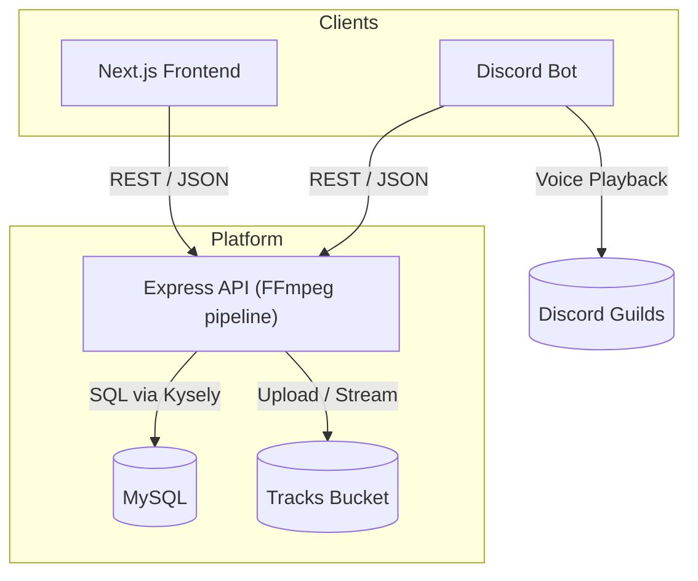
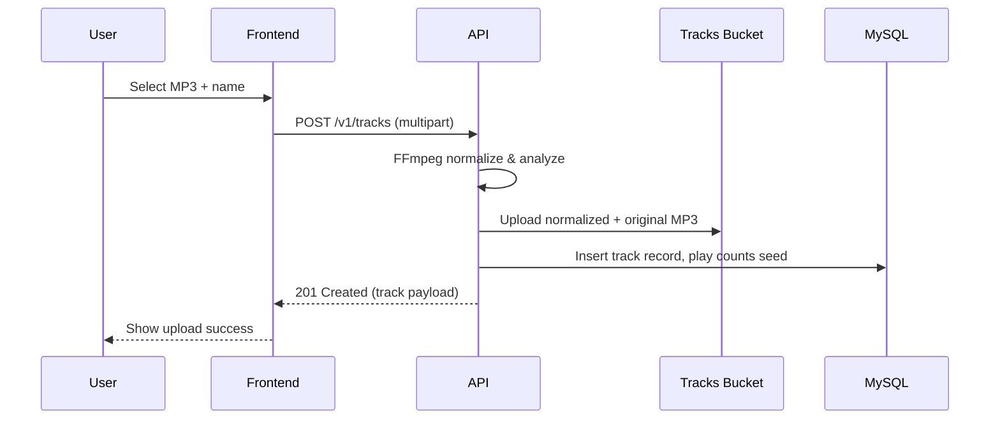
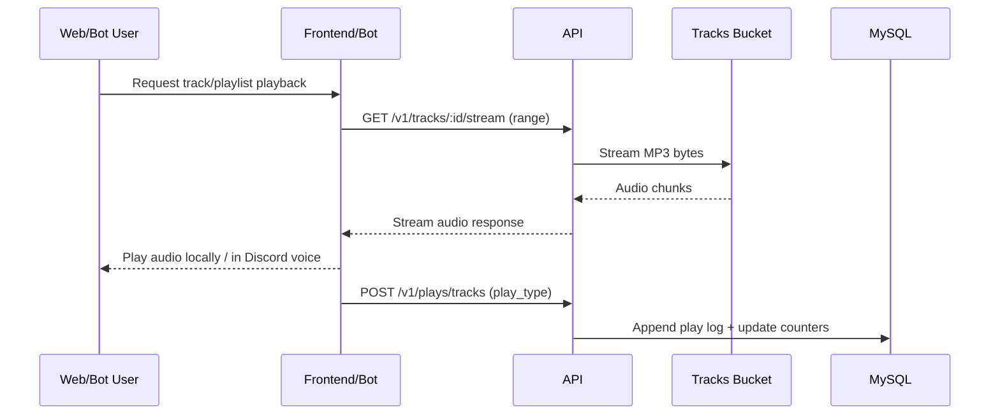

# KevBot Architecture

## 1. System Overview

KevBot unifies audio management across a Next.js frontend and a Discord bot, both powered by a shared Express + TypeScript API. The API orchestrates FFmpeg-based audio normalization, persists metadata in MySQL, and stores media files in Google Cloud Storage (GCS) while exposing REST endpoints under `/v1/*`. Local development runs through Docker Compose with auxiliary services for the database and a GCS emulator.

## 2. Core Components

- **Frontend (`frontend/`):** Next.js 15 App Router UI for authentication, uploads, browsing tracks, and playlist management. Communicates with the API via REST using the configured `NEXT_PUBLIC_API_URL`.
- **Discord Bot (`bot/`, planned):** Node.js service mirroring the API client contracts to enable command-driven playback, playlist curation, and greeting/farewell configuration inside Discord guilds.
- **Backend API (`api/`):** Express server with modular services, controllers, and routes. Handles authentication, track processing (including inline FFmpeg normalization), playlist logic, and play logging using Kysely for MySQL access.
- **Database (`db/`):** MySQL schema managed through semver migrations. Stores users, tracks, playlists, play logs, greetings/farewells, and play-count aggregates.
- **Storage (`gcloud/`):** Local emulator for Google Cloud Storage hosting normalized audio (`{trackId}.mp3`) and originals (`{trackId}.original.mp3`).
- **Audio Pipeline:** FFmpeg (via `fluent-ffmpeg`) is executed directly by the API process during uploads to normalize audio to EBU R128 standards and verify loudness before persisting.
- **Tooling (`tools/`):** Helper container and scripts for ad-hoc tasks; pattern will be reused for the upcoming bot service.

## 3. High-Level Architecture



- Both clients rely exclusively on the API for business logic and persistence.
- The API handles file uploads with temporary disk storage, invokes FFmpeg inside the same process for normalization/verification, and then writes the output to the tracks bucket.
- Track metadata, playlists, user preferences, and play counts live in MySQL, enabling consistent analytics across surfaces.

## 4. Track Upload Flow



Key constraints enforced during this flow:

- File extension `.mp3`, size ≤ 3 MB, duration ≤ 15 s.
- Name must be lowercase alphanumeric ≤ 15 characters and unique among active tracks.
- Loudness verified within ±2.5 LU of -16 LUFS with true peak ≤ -1.5 dBTP.

## 5. Playback & Logging Flow



- The Discord bot pipes the streamed response into the Discord voice connection using Discord.js/voice primitives.
- Random playlist sessions additionally invoke `POST /v1/plays/playlists/random` to track usage.

## 6. Deployment & Environment

- **Local Development:** `docker compose --env-file dev.env -f docker-compose.dev.yml up --build` starts API, MySQL, GCS emulator, frontend, and tools containers.
- **Service-Specific Compose:** Each service directory contains its own compose file for focused work (e.g., `api/docker-compose.dev.yml`). Planned `bot/` service will ship with a similar setup.
- **Configuration:** `.env`, `dev.env`, and `local_dev.env` must stay in sync. New environment variables require documentation and propagation across these files.
- **Secrets:** API reads MySQL connection URL, bucket config, and JWT secret from environment (validated in `configFactory`). Discord bot credentials (token, client ID) will be introduced under the same configuration discipline.

## 7. Repository Structure

```
api/        Express API source, tests, Dockerfile, build artifacts
frontend/   Next.js app routing, components, lib
bot/        (planned) Discord bot service mirroring API client logic
db/         MySQL migrations and migration tooling
gcloud/     Local GCS emulator with fixtures under data/
tools/      Utility container and scripts
.github/    CI workflows covering linting, migrations, deploy/reset jobs
```

## 8. Discord Bot Integration Notes

- The bot authenticates against the API using either user-issued JWTs or a bot service token with scoped permissions; all playlist and track mutations still route through `/v1/*`.
- Guild-specific settings (e.g., default playlists per channel) can be persisted by extending `users` or adding new MySQL tables, but should respect existing ownership checks.
- Audio playback leverages the same stream endpoint as the web client, keeping normalization and storage centralized in the API + GCS.
- Bot deployment should mirror `api/` patterns: Dockerized service, dedicated compose file, and CI workflow updates once implemented.

## 9. Observability & Telemetry

- API logging captures upload failures, normalization anomalies, and play logging errors.
- MySQL aggregates (`track_play_counts`, `track_play_type_counts`) drive engagement dashboards; expose aggregated stats via future API endpoints if required.
- Consider structured logs for Discord bot command usage to correlate with API metrics.

This architecture ensures the frontend and Discord bot remain thin clients while the API governs FFmpeg normalization, MySQL persistence, and GCS media storage across the KevBot platform.
