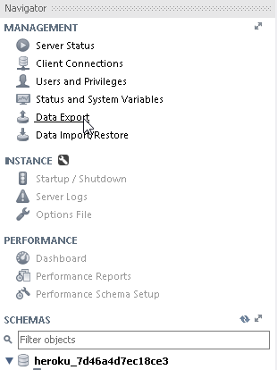
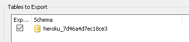
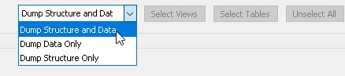
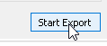
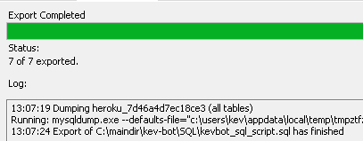

# How to backup SQL
1. Click data export

    

2. Check the database you want to export

    

3. Select structure and data

    

4. Select export to self-contained file 

    

5. Start the export

    

6. When the export is done you should see this message

    