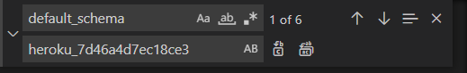
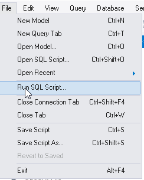

# How to sync test and production server structures with MySQL Workbench

1. Export the test servers structure. Make sure dump structure only is selected and make sure all the tables are selected. Export to a self-contained file and check the single transaction box.

    

2. Export the production server structure as you did in step 1 for the test server.

    

3. Run the removeDefiners.js script on both the test and production structure dumps. This produces two new files but with "_definers_removed" appended to the name.

    

4. Goto the database tab and select "Reverse Engineer". This will open the MySQL Model tab.

    

5. Cancel out of the window that pops up

    

6. Go back to the Database tab and select "Synchronize with Any Source"

    

7. Hit Next. On the "Select Sources" page, select the source file to be the the test structure export and set the destination source to be the production structure export. The ALTER script does not seem to matter, but pick a name for the file, it does not need to exist.

    

8. Hit next until the "Select Schemata" page. Make sure the box is checked, not bulleted.

    

9. Hit next until the "Select Changes to Apply" page. This will show a summary of the differences.

    

10. Hit next until the "Detected Changes" page. This shows the script that has been generated. This script when applied to the production server will update it to be in sync with the test server, structure wise. There are a few modifications that are needed though, so instead of executing it in this window, copy the file to clipboard and save it to a new file. Note, the save to file does not seem to work.

    

11. Refereences to AUTO_INCREMENT for tables can be deleted, they are kind of pointless.

    

12. All references to `default_schema` should be deleted from the update script.

    
    

13. Finally, open the production server and go to file "Run SQL Script".

    

14. Select the schema that should be updated and set the char set to `utf8`. Then hit run. If all goes well a window should pop up that says operation succesfull. 

    
